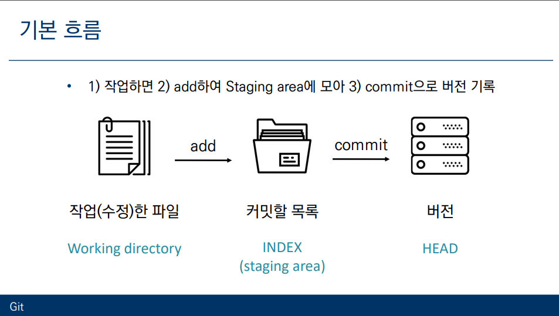
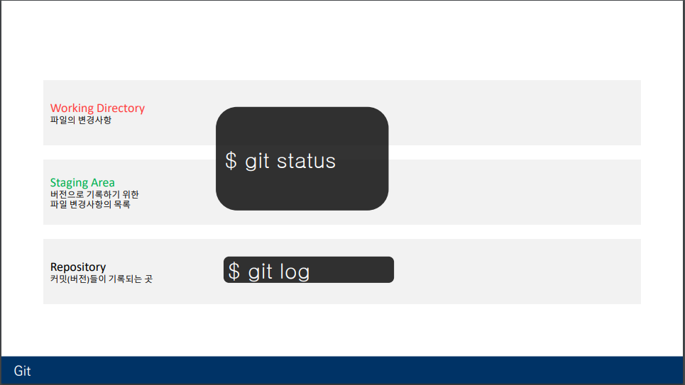
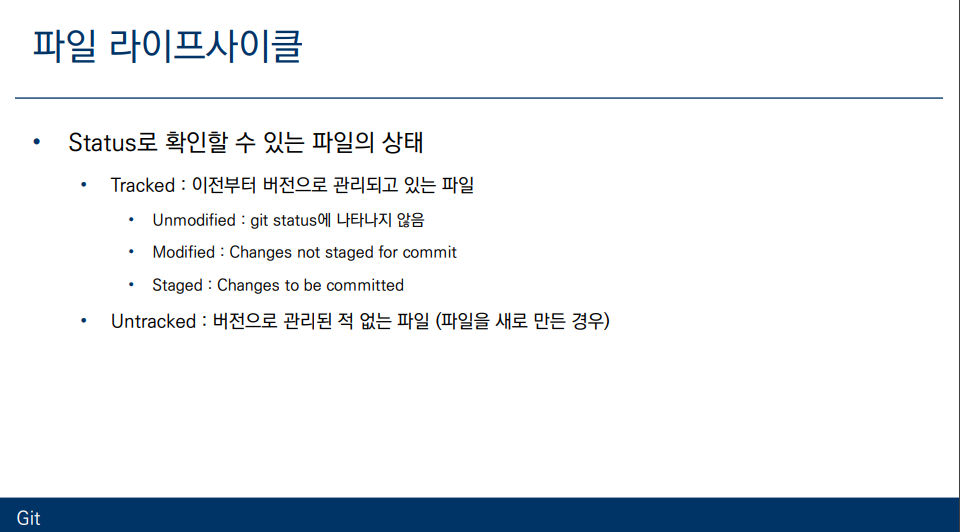
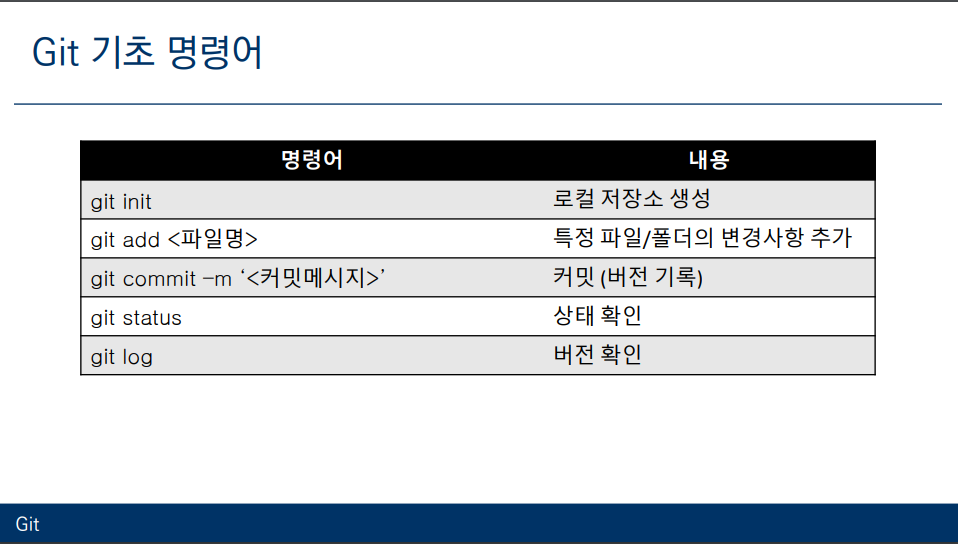
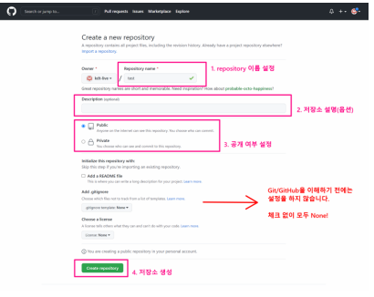
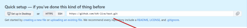
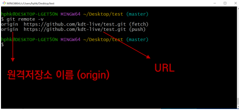

# git

1. ### $ git init

   * 특정 폴더를  git 저장소(repository)로 만들어 git 으로 관리
     * .git 폴더가 생성되며(숨겨져있음)
     * git bash 에서는 (master)라는 표기를 확인가능

2. ### 버전의 기록

   *  

		1. 작업
		1. add($git add .) 하여 Staging area 에 모아서 
		1. commit($ commit -m '버전의 이름') 으로 버전 기록

### `$ git add <file>`

* working directory 상의 변경 내용을 staging area 에 추가하기 위해 사용
  * untracked 상태의 파일을 staged 로 변경
  * modified 상태의 파일을 statged로 변경

### `$ git commit -m '<커밋 메세지>'`

* staged 상태의 파일들을 커밋을 통해 버전으로 기록

## 현재 상태 알기

* ### $ git log

  * 현재 저장소에 기록된 커밋을 조회
  * 다양한 옵션을 통해 로그를 조회할수 있음
    *  $ git log - 1 (최근 한줄만 로그조회)
    *  $ git log --oneline (한줄로 로그 조회)
    * $ git log -2 --o0neline (최근 두줄을 한줄로 로그조회)

* ### git status

  * git 저장소에 있는 파일의 상태를 확인하기 위해 사용
    * 파일의 상태를 알수있음
      * Untracked files
      * changes not staged for commit
      * changes to be committed
    * Nothing to commit , working tree clean

  

## 기초 명령어

## github 에서 원격 저장소를 만드는법

1. `github` 홈페이지의 오른쪽 상단 프로필 옆 +버튼을 눌러 New Repositiory 클릭

2. 저장소 설정하기

     

   3. 자신의 주소 확인 (https://github.com/`깃허브 닉네임`/`저장소 이름`)

      

## 원격저장소의 경로 설정

 	1. 원격 저장소 정보를 로컬 저장소에 추가 ($ git remote add origin/`깃허브 닉네임` /`저장소 이름`)	

2. 원격 저장소의 정보를 확인

   1. `git reomte -v`

   

   
   
   ## 원격저장소 활용
   
   1.  **$ git push `원격저장소이름`  `브랜치이름`**
   
      * 원격 저장소로 로컬 저장소 변경 사항(커밋된것)을 push(올림)
      * 결코 파일이 올라가는 것이 아닌, 버전 (커밋)이 올라가는것
      * 나의 로컬을 **공유** 하는 방법
   
      
   
   2.   **$ git pull `원격저장소이름`  `브랜치이름`**
   
      * 원격 저장소의 **변경된** 내용을 가져와서 **병합함**
   
      * 프로젝트 개발 중 다른 사람 커밋을 받아오는 용도
   
        
   
   3.   **$ git init**
   
      * 로컬의 새로운 프로젝트 시작(이 파일들을 `git`으로 관리)
   
        
   
   4.  **버전 관리와 상관 없는 파일(자신의 로컬에서만 필요한 파일들) 관리법**
   
      * .gitignore 파일을 생성후 관리
   
        * 특정 파일 :` a.txt, test/a.txt` (테스트 폴더의 a.txt)
        * 특정 디렉토리(폴더) :` /ignore_dir`
        * 특정 확장자 :` *.exe` 
        * 예외 처리 : !b.exe
   
      * 이미 커밋된 파일은 반드시 삭제를 해야 관리 가능합니다. (프로젝트 시작전 설정 필요)
   
        
   
      * **참고 사이트**
   
        * 개발 환경(운영체제 , 텍스트 에디터) 에 따라 ignore 할 파일을 찾아주는 사이트 
   
          * https://www.toptal.com/developers/gitignore/
   
          
   
        

​		   

