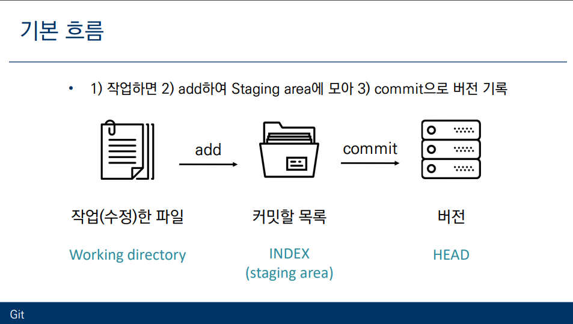
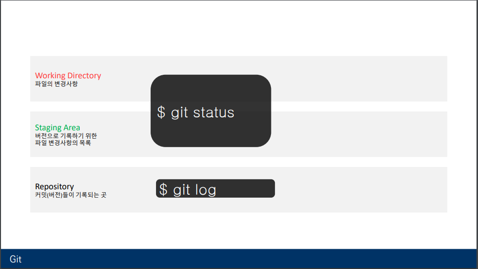
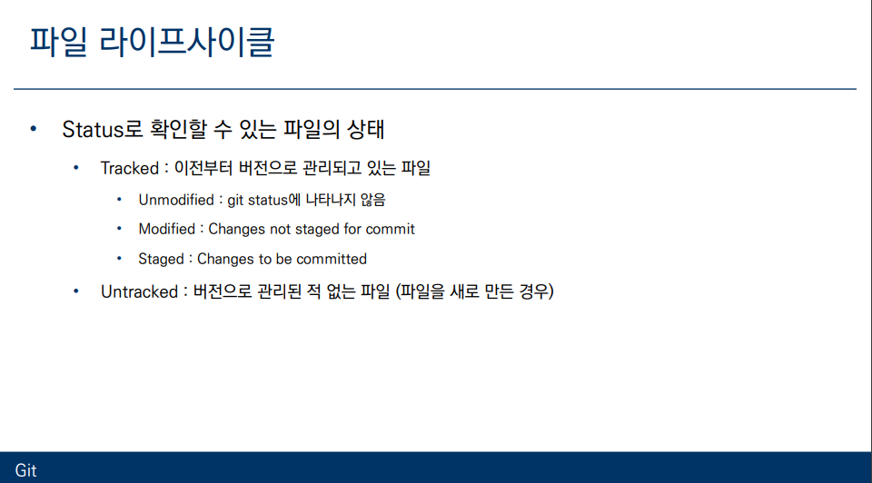
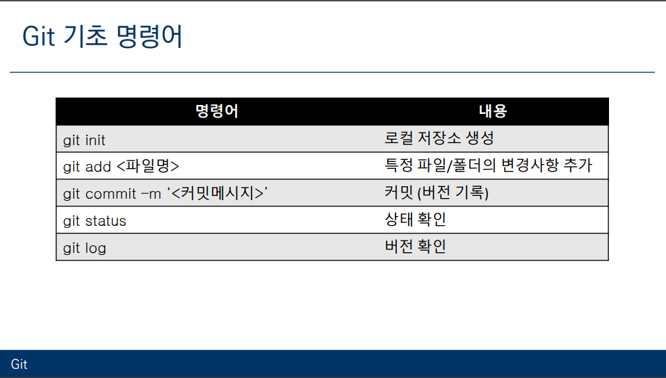

# git

1. ### $ git init

   * 특정 폴더를  git 저장소(repository)로 만들어 git 으로 관리
     * .git 폴더가 생성되며(숨겨져있음)
     * git bash 에서는 (master)라는 표기를 확인가능

2. ### 버전의 기록

   *  

		1. 작업
		1. add($git add .) 하여 Staging area 에 모아서 
		1. commit($ commit -m '버전의 이름') 으로 버전 기록

### `$ git add <file>`

* working directory 상의 변경 내용을 staging area 에 추가하기 위해 사용
  * untracked 상태의 파일을 staged 로 변경
  * modified 상태의 파일을 statged로 변경

### `$ git commit -m '<커밋 메세지>'`

* staged 상태의 파일들을 커밋을 통해 버전으로 기록

## 현재 상태 알기

* ### $ git log

  * 현재 저장소에 기록된 커밋을 조회
  * 다양한 옵션을 통해 로그를 조회할수 있음
    *  $ git log - 1 (최근 한줄만 로그조회)
    *  $ git log --oneline (한줄로 로그 조회)
    * $ git log -2 --o0neline (최근 두줄을 한줄로 로그조회)

* ### git status

  * git 저장소에 있는 파일의 상태를 확인하기 위해 사용
    * 파일의 상태를 알수있음
      * Untracked files
      * changes not staged for commit
      * changes to be committed
    * Nothing to commit , working tree clean

  

## 기초 명령어

