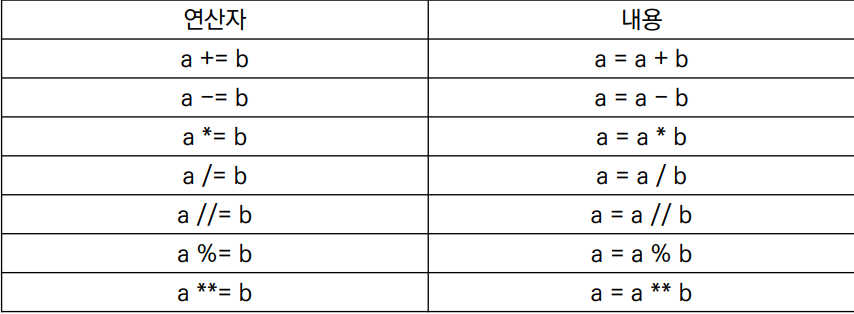

# 파이썬 정리

## 1. 파이썬의 특징

* **Easy to learn**
  * 다른 프로그래밍 언어보다 문법이 간단하고 엄격하지 않음
    * 변수의 별도의 타입 지정이 필요없음
  * 문법 표현이 매우 간결하여 프로그래밍 경험이 없어도 짧은 시간 내에 마스터할 수 있음
    * 문장을 구분할 때 중괄호 대신 들여쓰기를 사용
  * 같은 작업에 대해서도 c나 자바로 작성할 때 보다 더 간결하게 작성이 가능하다
* **인터프리터 언어**
  * 소스코드를 기계어로 변환하는 컴파일 과정 없이 바로 실행 가능
  * 코드를 대화하듯 한 줄 입력하고 실행한 후 바로 확인이 가능
* **객체 지향 프로그래밍(object)**
  * 파이썬은 객체지향 언어이고 모든 것이 객체로 구현되어 있음
    * 객체:숫자 문자 클래스 등 값을 가진 모든것

## 2. 기초문법

* **코드 스타일 가이드**

  * 파이썬이 제안하는 스타일 가이드
    * PEP8 (https://www.python.org/dev/peps/pep-0008/ )
  * **기업 오픈소스 등에서 사용하는 스타일 가이드**
    * Google Style guide (https://google.github.io/styleguide/pyguide.html) 등
  * **들여쓰기**
    * Space Sensitive
      * 문장을 구분할땐 들여쓰기 사용
      * 들여쓰기 할때는 4칸 혹은 1탭을 입력
      * 한 코드 안에는 반드시 한 종류의 들여쓰기를 사용 (4칸이면 4칸 1탭이면 1탭)

* **변수**

  * 변수는 `=` (할당 연산자)를 통해 값을 할당 (같다는 의미가 아님)
* `type()`
  * 변수에 할당된 값의 타입
* `id()`
  * 변수에 할당된 값 , 메모리 주소
* `변수의 할당` 
  * 같은 값을 동시에 할당할 수 있음
  * 다른 값을 동시에 할당 할수 있음
  * `tmp` 는  보통 임시로 값으르 저장할 변수의 이름으로 씁니다

* 식별자 (IDentifiers)

  * 파이썬 `객체(변수 함수 모듈 클래스)`를 식별하는데 사용하는 이름

  * 규칙

    * 식별자의 이름은 영문 알파벳 ,언더스코어_로 구성된다(띄어쓰기 x)

    * 첫글자에 숫자가 올 수 없음

    * 길이제한이 없음 

    * 대소문자를 구별

      

## 3. 자료형

	### 1. 불린형

* True / False 값을 가진 타입은 bool
* 비교/논리 연산을 수행함에 있어서 활용됨
* 다음은 모두 False 로 변환
  * `• 0, 0.0, (), [], {}, '', None`
* boll() 함수
  * 특정 데이터가 true 인지 false 인지 검증

### 2. 수치형

* `int(정수)`
* `float (부동소수점,실수)`
* `문자열 (string)`
  * 모든 문자는 `string`타입
  * 문자열은 묶을 때 동일한 작은 따옴표나 큰 따옴표를 활용하여 표기
  * 역 슬래쉬를 사용하여 괄호안의 따옴표 등을 표현가능
  * 삼중 따옴표
    * 따옴표 안에 따옴표를 넣을 때, 여러줄을 나눠 입력할때 편리
    * 
* `None`
  * 파이썬의 자료형 중 하나
  * 값이 없다는 뜻
  * 반환 값이 없는 함수에서 사용하기도 함
  * 

## 3. 연산자(oprerator)

### 복합 연산자

* 연산과 할당이 함께 이뤄짐

### 비교 연산자

* 값을 비교하며 true / false 값을 리턴함
* 

## 문자열 연산자

* **인덱싱**
  * 인덱스를 통해 값에 접근가능
  * 컴퓨터는 0부터 센다고 생각
* **슬라이싱**

* ​	2번쨰 초과 5번쨰 미만

  * s[2:5:2] == ce  2부터 5의 범위까지 2씩 증가시킨 값
  * s[5:2:-1] == fed (5와 2의 범위 내에서 -1씩 (반대로))
  * s[:3] == abc (처음부터 3번까지)
  * s[5:] == fghi (끝부터 5번까지)
  * s[::] == abcdefghi (처음부터 끝까지)
  * s[;;-1] == ihgfedcba (끝부터 반대로 처음까지)

* **레인지**

  * 기본형 : range(n)

    * 0부터 n-1 까지의 숫자의 시퀸스

  * 범위 지정 : range(n , m)

    * n부터 m-1 까지의 시퀀스

    범위 및 스텝 지정 : range(n, m , s)

    ​	n부터 m-1 까지 s만큼 증가시키며 숫자의 시퀀스

    

    